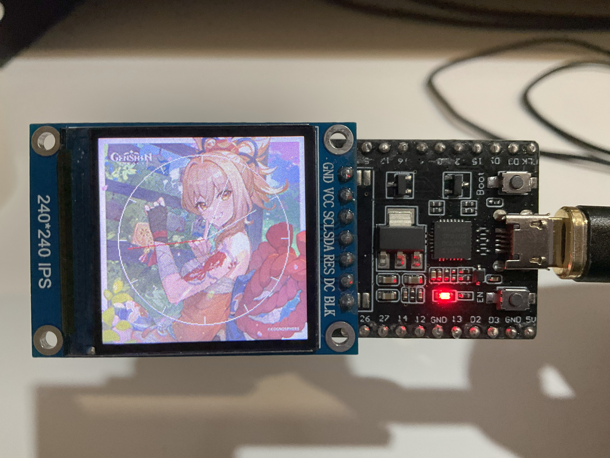
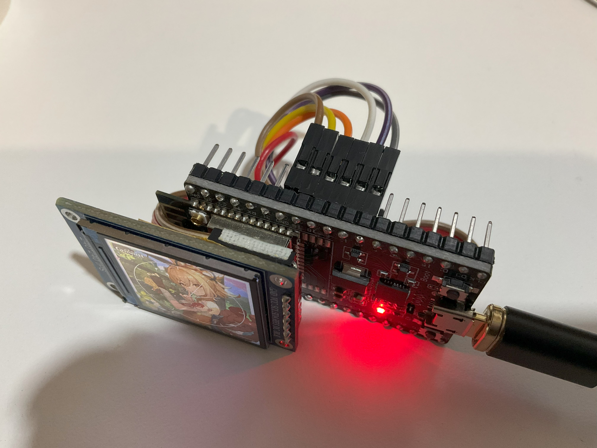

# A simple analog clock with customizable picture as background
```
This project is based on ESP32 dev-board, in this case, I use ESP32_DEVKitc_V4.
The screen I use here is based on ST7789 with a resolution of 240x240, also ST7735 is available in this project.
```
## The Final Result of the Project


(BTW) Yoimiya is so adorable that the reason I use her as background. TAMAYAAAAAA~~

## 1. Before Starting
Prepare the element that used in this project:
```
An ESP32 based dev-board
A ST7735 or ST7789 based screen
|- Notice: It is strongly recommended that the screen used needs to contain the CS (Chip Select) pin.
A USB cable for uploading firmware to ESP32
A few of Jumpers (around 7~8)
A computer that been installed the Arduino IDE and Python
```
Introduce of ESP32
```
ESP32 is a powerful MCU that made by Espressif Systems.
Support wireless connnection such as Wi-Fi and Bluetooth.
In some models, there are dual cores for double the performance.
```
## 2. Wiring Diagram
```
Screen              | Dev-board
--------------------------------
GND (Ground)        | GND (Connect to any GND available on your dev-board)
VCC (Power)         | 5V or 3V3 (5V for more bright)
SCL (SCLK)          | GPIO 18 (The default of ESP32's SCLK is 23)
SDA (MOSI)          | GPIO 19 (The default of ESP32's MOSI is 19)
RST (Reset)         | GPIO 17
DC  (Data/Command)  | GPIO 16
CS  (Chip Select)   | GPIO 5
BLK (Back Light)    | 3V3 or assign a GPIO pin for control back light 

These pins are fully customizable if you want to assign them how you like.
```
After that, you can connect the dev-board to your computer via usb cable. <br />
If your computer cannot recognize the dev-board. <br />
You might have to install the driver for the uart bridge.
```
CH340 and CP2102 are the common uart bridge for dev-boards in nowsday.
For CH340:
    https://www.wch.cn/download/CH341SER_EXE.html
For CP2102:
    https://www.silabs.com/developers/usb-to-uart-bridge-vcp-drivers?tab=downloads
```
## 3. Prepare Tools and Dependencies
After install Arduino IDE and Python in your computer. <br />
Here's some require dependencies have to install. <br />
```
Open a terminal or cmd.

pip: 
    In Linux, you can install pip via the package manager like apt or pacman.
    Debian-based:
        > sudo apt-get install python3-pip
    Archlinux-based:
        > sudo pacman -S python-pip
    
    For other Linux or Windows or Macintosh:
    Download this script:
        > https://bootstrap.pypa.io/get-pip.py
    Then run in termial:
        > python3 get-pip.py

pillow:
    Run these command in terminal:
        > pip3 install pillow
        > python3 -m pip install pillow
    
    If you got the error during install pillow, like Archlinux.
    You might have to install jpeg library.
        > sudo pacman -S jpeglib-turbo
    
    If you get the error like: "error: externally-managed-environment"
    Add "--break-system-packages" at last.
    Such as:
        > pip3 install pillow --break-system-packages
        > python3 -m pip install pillow --break-system-packages
```
```
Open Arduino IDE

Install ESP32 dev-boards support:
    1. Select "Tools" > "Board" > "Board Manager"
    2. Search "esp32"
    3. Find out and install the board support provided by Espressif Systems

Install Libraries:
    1. Select "Sketch" > "Include Library" > "Manage Libraries"
    2. Search and install these libraries:
        (keyword: adafruit gfx)  "Adafruit GFX Library" by Adafruit
        (keyword: adafruit st77) "Adafruit ST7735 and ST7789 Library" by Adafruit
        (keyword: ntpclient)     "NTPClient" by Fabrice Weinberg
        (keyword: timelib)       "Time" by Micheal Margolis
```
## 4. Prepare Picture for Background
Prepare a picture that you wanna use as background of clock. <br />
Assure the size of picture matchs the resolution of screen. <br />
You can use some tools like Photoshop to edit your picture that size is matched. <br />
After the preparation of picture done. <br />
Clone this respository on your computer. <br />
You can download it manually or run this command in terminal if your computer have git.
```
git clone https://github.com/Zhi-Xun-Huang/ESP32_Analog_Clock.git
```
After that, put your picture into the folder and rename the folder that matched xxx.ino in folder.
## 5. Convert Picture
Open a terminal that in the project folder and run these commands.
```
> ls
```
After that, you will see some file like: ```README.md  esp32_st7789_optimized.ino  image2header_cvt.py your_picture.png```
```
> python3 image2header_cvt.py your_picture.png
```
After that, you will see a message "Convert Complete" and there is a new file genarate called ```image_data.h```
```
> ls
```
Assure ```image_data.h``` is in your project folder.
## 6. Compile and Upload Firmware
Open ```esp32_st7789_optimized.ino``` in Arduino IDE. <br />
You can modify the defination in ```esp32_st7789_optimized.ino```. <br />
For different wiring and resolution, modify these defination:
```
// Pin definitions for ST7789
#define TFT_CS     5  // Chip_Select pin
#define TFT_RST   17  // Reset pin
#define TFT_DC    16  // Data / Command pin
#define TFT_MOSI  19  // MOSI (Master Out Slave In) pin
#define TFT_SCLK  18  // SCLK (SPI Clock) pin
#define TFT_BLK   -1  // Back Light pin (-1 for not use)

// Setup display size
#define TFT_WIDTH  240
#define TFT_HEIGHT 240
```
For ST7735 screen, modify from ```#include Adafruit_ST7789.h``` to ```#include Adafruit_ST7735.h```. <br />
Comment these lines that is for ST7789.
```
Adafruit_ST7789 tft = Adafruit_ST7789(&spi, TFT_CS, TFT_DC, /*TFT_MOSI, TFT_SCLK,*/ TFT_RST);
tft.init(TFT_WIDTH, TFT_HEIGHT);
```
Uncomment these lines in code that is for ST7735.
```
Adafruit_ST7735 tft = Adafruit_ST7735(&spi, TFT_CS, TFT_DC, /*TFT_MOSI, TFT_SCLK,*/ TFT_RST);
tft.initR(INITR_BLACKTAB);
tft.setAddrWWindow(0, 0, TFT_WIDTH - 1, TFT_HEIGHT - 1);
```
Assign your Wi-Fi ssid and password at these lines.
```
const char* ssid = "your_ssid";
const char* password = "your_password";
```
Modify timezone offset that matched your country, value based on second.
```
const long utcOffsetInSeconds = 28800; 
```
After that, compile and upload to your dev-board. <br />
Then you will see your picture and clock on the screen. <br />
## 7. Usage of Button on ESP32
```
Enable (Reset) button: reset the ESP32.
Boot button: rotate the screen direction.
```
